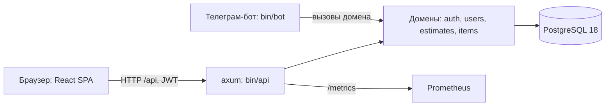

# Архитектура

Как устроен проект и почему. Читается за 10 минут.

## Общая схема



Один процесс `api` обслуживает и HTTP API, и статику фронта.

## Клиенты: как добавляются новые

Сегодня клиентов два: SPA (same-origin, JWT) и заготовка бота (зовёт
домен напрямую). Чтобы будущие клиенты (мини-апп, мобильное приложение,
публичное API) добавлялись дёшево и не влезали в API для фронта:

- Вся бизнес-логика — в транспорто-независимых функциях домена; хендлер
  только разбирает запрос и зовёт домен. Новый клиент — это новый тонкий
  адаптер: свой роутер-префикс или бинарь поверх тех же доменных функций,
  либо просто потребитель того же HTTP API (браузерному внешнему клиенту —
  origin в `CORS_ORIGINS`, раздел ниже).
- В хендлерах фронтового API не появляется ветвлений «а если это
  мини-апп»: нужно другое поведение — это другой адаптер, а общая часть
  уезжает в домен.
- Новая механика входа (initData Телеграма, API-ключи) — отдельный
  extractor рядом с `CurrentUser`; существующий флоу не трогается.
- Заранее НЕ делаем: версионирование `/v1`, отдельный BFF-процесс,
  таблицу API-ключей. Это появится вместе с первым настоящим внешним
  клиентом — границы выше делают такую задачу дешёвой.

## Домены (DDD-lite: вертикальные срезы)

Каждый домен — папка в `server/src/` со своей логикой, HTTP-слоем и SQL:

```
server/src/
  core/        инфраструктура, общая для доменов:
    config.rs    ВСЯ конфигурация: Settings::from_env() до старта HTTP
    db.rs        пул, миграции
    error.rs     единый ApiError с ключами локализации и полевыми ошибками
    health.rs    /api/health/{live,ready}, /api/version
    i18n.rs      словари fluent, выбор языка запроса
    telemetry.rs логи (tracing) + метрики (prometheus)
    mailer.rs    отправка писем (кладёт в outbox-очередь)
    jobs.rs      фоновый воркер (доставка писем, чистка токенов)
    rate_limit.rs ограничение частоты запросов по IP
    storage.rs   файлы пользователей на локальном диске (FILES_DIR)
    time.rs      время в ответах API — RFC 3339 в UTC
  auth/        вход, регистрация, JWT, 2FA, восстановление пароля, OAuth,
               сессии (sessions.rs) и настройки аккаунта (account.rs)
  users/       пользователи, роли, профиль
  estimates/   сметы: загрузка файла, карточка, состояние разбора
  items/       примерная бизнес-сущность (переименовать в первую настоящую)
  bin/         api (сервер), ops (операторские команды), bot (заглушка)
```

Правила границ:

- Домен НЕ лезет в таблицы чужого домена — только через его публичные функции.
- `core` не знает о доменах; домены знают о `core`.
- Права проверяются В ЗАПРОСЕ, а не отдельным `if` после выборки: доменные
  функции items принимают владельца и всегда фильтруют по нему. Чужая и
  несуществующая запись отвечают одинаково (404) — по ответу нельзя узнать,
  что такая запись вообще есть.
- HTTP-слой домена (`http.rs`) — тонкий: разбор запроса, вызов домена, ответ.
- Новый домен = новая папка по тому же образцу; когда доменов станет много и
  компиляция замедлится — выносить в отдельные crates (границы уже готовы).

## Контракт API

- OpenAPI генерируется из кода (utoipa) и лежит в `openapi.json` (корень).
- Фронт получает типы автоматически: `pnpm gen:api` → `web/src/api/schema.d.ts`.
- Тест на бэке падает, если код разошёлся с `openapi.json`; проверка на
  фронте падает, если типы разошлись со спекой. Контракт не может устареть.
- Валидации (мин. длина пароля и т.п.) описаны в спеке и проверяются тестом
  на совпадение с константами кода.
- Направление осознанно code-first: Rust-код первичен, спека — производная.
  Генерировать Rust-сервер из спеки (openapi-generator и т.п.) не делаем:
  генерённые стабы неидиоматичны, плохо переживают ручные правки и дают то
  же самое, что utoipa, только с лишним шагом. Кодогенерация из спеки
  уместна в одном случае — клиент к ЧУЖОМУ API (crate `progenitor`);
  для своего API источник правды — код + тест дрифта.

## Аутентификация

- Пароли — argon2id. Access-токен — JWT (15 мин), живёт только в памяти
  фронта. Refresh-токен — httpOnly cookie, хранится в БД хешем, ротируется
  при каждом обновлении, отзываемый.
- 2FA — TOTP (приложение-аутентификатор). Логин при включённой 2FA — в два
  шага через короткоживущий pending-токен.
- Восстановление пароля и подтверждение почты — одноразовые токены на
  email (в БД хранятся только хеши).
- Auth-ручки ограничены по частоте с одного IP (`RATE_LIMIT_AUTH_RPM`,
  по умолчанию 30/мин, 0 — выключить) — защита от перебора паролей.
- OAuth (VK ID, Яндекс ID) — универсальное подключение конфигом через env,
  без кода на провайдера: `docs/oauth.md`.
- Роли: `user`, `admin` — колонка в users, проверка на уровне extractor'а.
  Роль выдаётся командой `ops promote-admin <email>`.
- Сессии видны пользователю: список устройств, отзыв одной или всех прочих.
  Refresh ротируется, поэтому у сессии есть сквозной `session_id` и время
  начала — иначе список показывал бы новую «сессию» каждые 15 минут.
  Сырые User-Agent и IP не храним: только короткое «Chrome, macOS».
- Смена пароля гасит все сессии; смена почты подтверждается письмом на новый
  адрес, а на старый уходит уведомление.

## Конфигурация

- Единственная точка чтения окружения — `core/config.rs`. `Settings::from_env()`
  вызывается первой строкой в `bin/api` и `bin/ops`: неверная настройка
  означает, что процесс не поднялся, а не «упал на первом запросе через
  неделю». Скрипт `check-suppressions.sh` следит, чтобы `env::var` не
  расползался обратно по доменам.
- Секреты обёрнуты в тип `Secret`: его `Debug` печатает звёздочки, поэтому
  секрет не попадёт в лог даже случайно.
- Пример настроек — `.env.example` (dev) и `.env.prod.example` (прод).

## Готовность и остановка

- `/api/health/live` — процесс отвечает; `/api/health/ready` — доступна БД
  (SELECT 1 с таймаутом 2 с); `/api/version` — версия и коммит сборки.
  SMTP и OAuth в readiness сознательно не входят: авария почты не должна
  перезапускать приложение.
- В проде у контейнера `app` healthcheck на ready (`api healthcheck` — в
  образе нет curl, зато есть свой бинарь), Caddy стартует после него.
- По SIGTERM/Ctrl+C HTTP завершает начатые запросы, а фоновый воркер не
  берёт новую пачку писем.

## Защита HTTP

- Таймаут запроса 15 с, тело не больше 1 МиБ (на auth-ручках — 16 КиБ).
  Единственное исключение — загрузка сметы (`POST /api/estimates`): файл до
  10 МиБ, таймаут 60 с и свой лимит частоты (`RATE_LIMIT_UPLOAD_RPM`).
  Поэтому общий таймаут висит на всех маршрутах, кроме неё: снаружи его уже
  не удлинить — вложенный слой не может пережить внешний.
- Маршруты, меняющие cookie-состояние, отклоняют чужой `Origin`.
- `X-Forwarded-For` учитывается только при `TRUST_PROXY=true` — иначе
  лимит по IP обходился бы подделкой заголовка при деплое без Caddy.
- Caddy добавляет CSP и другие заголовки безопасности, кэширует
  хешированные ассеты вечно, а `index.html` — никогда.

## Локализация

- Языки: ru (по умолчанию), en. Бэк отвечает на языке заголовка
  Accept-Language; все тексты — в `server/locales/{ru,en}/main.ftl`
  (Fluent: правильные склонения и множественные формы).
- Фронт — i18next, словари `web/src/locales/{ru,en}.json`.
- Новый язык = один файл на бэке + один на фронте; тесты сверяют полноту
  ключей и то, что ответы API действительно локализованы.

## Наблюдаемость

- Логи: tracing; в dev — читаемые, в проде — JSON (`LOG_FORMAT=json`),
  у каждого запроса request-id. Ошибки фронта прилетают на `/api/logs`
  и попадают в общий поток с пометкой frontend.
- Метрики: Prometheus на `/metrics` отдельного порта (`METRICS_ADDR`):
  латентность и коды HTTP по маршрутам, плюс доменные счётчики.

## Письма и фоновые задачи

- Единственная точка отправки писем — `core/mailer.rs`: письмо всегда
  кладётся в таблицу `outbox_emails` (надёжная очередь в той же БД).
- Фоновый воркер (`jobs.rs`, живёт в процессе api) забирает
  неотправленные письма пачками через `FOR UPDATE SKIP LOCKED` и шлёт по
  SMTP (lettre). `SMTP_URL` не задан — письма остаются в outbox: так
  работают dev и тесты. После 5 неудач письмо больше не берётся.
- Он же раз в час зовёт `auth::cleanup_expired_tokens` — протухшие
  refresh/reset/verify-токены удаляет сам домен, которому они принадлежат.
  Поэтому воркер лежит не в `core`: `core` о доменах не знает, а
  планировщик знает по определению.
- Он же разбирает загруженные сметы: сам цикл разбора живёт в домене
  `estimates` (`worker.rs`), планировщик только будит его по тику
  (`WORKER_TICK_SECS`). Очередь — в самой таблице `estimates`: смета берётся
  в работу коротким UPDATE со `SKIP LOCKED`, транзакция не держится всё
  время разбора, зависшая в `parsing` дольше 10 минут (убитый процесс)
  берётся заново, после трёх попыток — честный отказ пользователю.
- Redis и брокеры сознательно не используются: Postgres закрывает очередь
  задач до совсем других масштабов. Отдельной универсальной таблицы задач
  нет: первая фоновая задача живёт статусом в своей таблице, а общая
  таблица с payload'ами появится со второй — когда станет понятно, что у
  них общего.

## CORS

По умолчанию выключен: SPA раздаётся тем же бинарём, запросы same-origin.
Первому внешнему браузерному клиенту (например, Telegram Mini App) —
перечислить его origin'ы в `CORS_ORIGINS` через запятую.

## Деплой

- Один сервер, один файл: `compose.prod.yaml` — Caddy (автоматический TLS
  по `DOMAIN`) -> app (Dockerfile) -> Postgres с volume + сервис бэкапа
  (ежесуточный `pg_dump`, хранятся последние 7 архивов).
- У приложения есть состояние на диске: загруженные сметы лежат в
  `FILES_DIR` и смонтированы volume'ом `files`, иначе файлы исчезали бы при
  каждой пересборке контейнера. В `pg_dump` они не попадают — бэкап файлов
  отдельная задача (бэклог, триггер — первый прод с реальными данными).
- Настройки — в `.env.prod` (пример: `.env.prod.example`), запуск:
  `docker compose -f compose.prod.yaml --env-file .env.prod up -d --build`.
- Обновления зависимостей приносит Renovate (`renovate.json`,
  еженедельно), проверяет их обычный CI.
- Операторские команды — бинарь `ops` в том же образе:
  `docker compose -f compose.prod.yaml exec app ops promote-admin <email>`,
  `ops outbox list-failed`, `ops outbox retry <id>`, `ops config check`.

## Проверки качества

- `make check` — быстрое: формат, clippy с явной таблицей запретов, Biome
  (формат + линт фронта), tsc, размер файлов, запрет подавлений проверок,
  неиспользуемые зависимости.
- CI добавляет то, что требует сети: cargo-deny (уязвимости, лицензии,
  источники), gitleaks, OSV-Scanner, actionlint, проверку конфигурации
  Renovate и сборку docker-образа со smoke-проверкой.
- CodeQL не подключён: репозиторий приватный, а без GitHub Code Security
  он недоступен. Замену (Semgrep и т.п.) сознательно не городим.
- Тесты UI — три уровня: схемы страниц (ARIA-дерево, описанное руками в
  `web/e2e/layout.spec.ts`) проверяют структуру; скриншоты трёх ширин
  экрана (`web/e2e/visual.spec.ts` + `playwright.visual.config.ts`,
  собранный фронт со стабами API — без бэкенда) проверяют геометрию;
  статический чек собранного CSS (`scripts/check-animations.mjs`)
  запрещает анимации layout-свойств. Скриншот-эталоны
  (`web/e2e/__screenshots__/`) рендерит только CI-джоб visual в
  контейнере Playwright; обновление — ручной запуск workflow с галкой
  `update-visual` и коммит скачанного артефакта.

## Данные

PostgreSQL 18. Миграции — sqlx, файлы в `server/migrations/`, применяются
при старте api. SQL проверяется интеграционными тестами на реальной базе.
